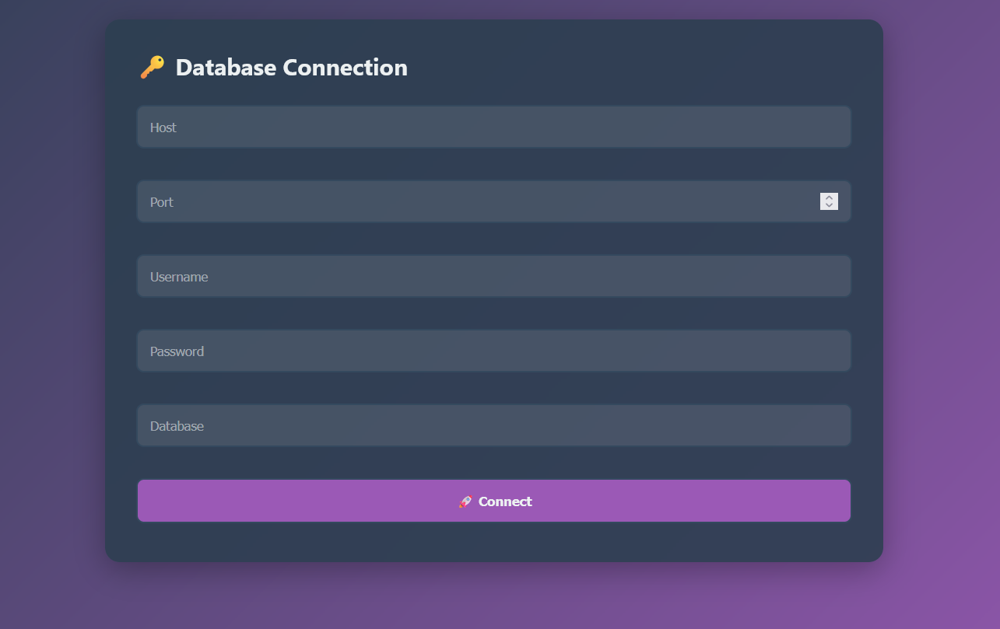
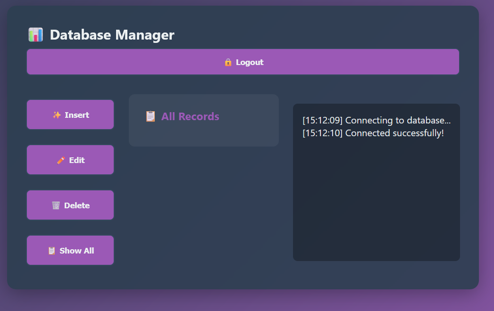
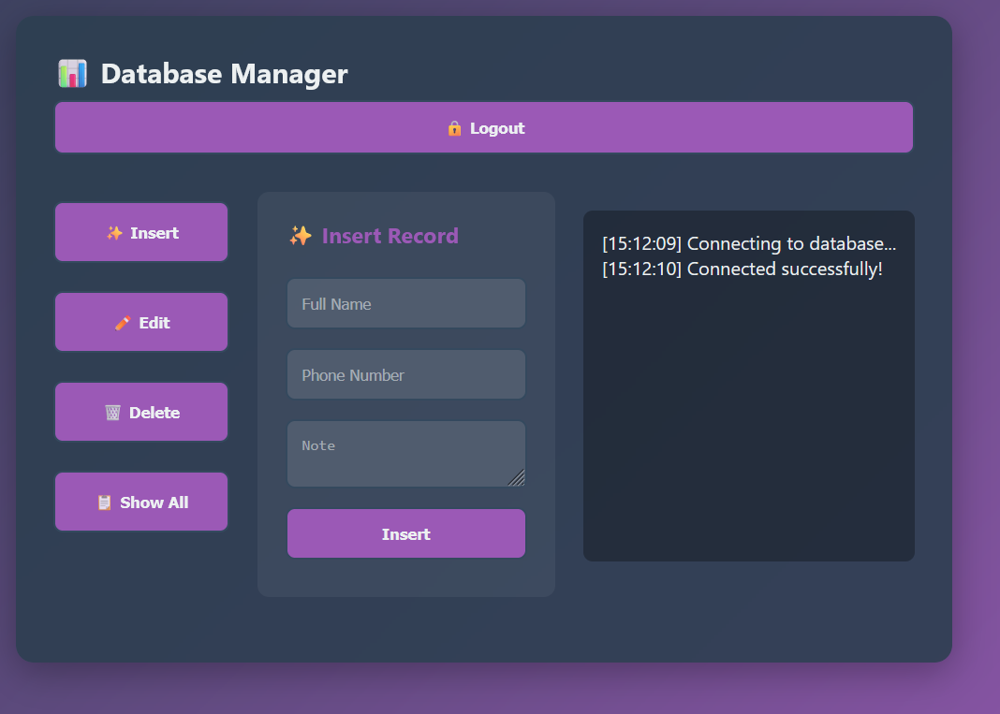

# DBFrontend

- Интерфейс для взаимодействия с базой данных (вдохнавлено [расширением для vscode](https://github.com/mtxr/vscode-sqltools))

## Preview

- Main

  

- All records

  

- Insert

  

